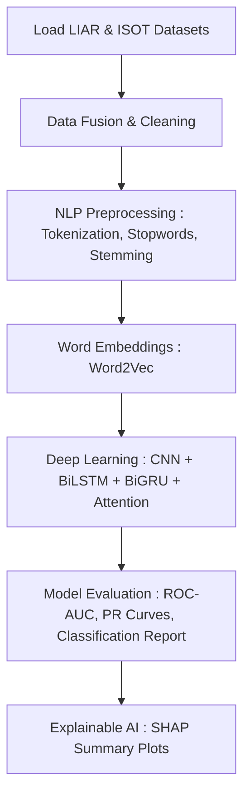

# Textual Fake News Detection

This project presents a robust, end-to-end deep learning pipeline for detecting fabricated and misleading news articles using a unified dataset crafted from the **LIAR** and **ISOT** benchmarks. It leverages advanced Natural Language Processing (NLP), deep sequence modeling, and state-of-the-art model interpretability frameworks:

- **Hybrid Deep Learning Architecture** combining Convolutional Neural Networks (CNNs) for local feature extraction, Bidirectional LSTMs/GRUs for sequential context, and Multi-Head Attention mechanisms for long-range dependency tracking.
- **Robust NLP Preprocessing** pipelines to handle diverse text inputs, including contraction expansion, noise reduction, stopword removal, stemming, and lemmatization.
- **Custom Semantic Embeddings** trained from scratch using Gensim's `Word2Vec` to capture domain-specific semantic relationships within the political and news corpus.
- **Explainable AI (XAI) Integration** via **SHAP** (SHapley Additive exPlanations) to crack open the "black box" and visualize exactly which words and embedding dimensions drive the model's classifications.

---

## Pipeline Overview

---

## Notebook Structure & Code Architecture
The entire pipeline is self-contained within the `Textual_Fake_News_Detection.ipynb` notebook, moving sequentially from raw data ingestion to model interpretation.

1. Ingestion & Data Fusion
  - **Dual-Dataset Loading:** Merges the multi-class LIAR and binary ISOT datasets.
  - **Alignment & Splitting:** Binarizes all targets, shuffles the data, and applies stratified boundaries for Training (70%), Validation (15%), and Testing (15%) splits to maintain class ratios.

2. Preprocessing & Text Cleansing Engine
  - **Noise Reduction:** Converts text to lowercase, expands contractions, and uses regular expressions to scrub URLs, digits, and punctuation.
  - **Linguistic Formatting:** Employs NLTK to tokenize text, drop stop words, and apply stemming/lemmatization to reduce words to their base roots.

---

## Results and Visualization

Instead of static confusion matrices, the system generates a **System Health Timeline** for every fault. 

 
   

This dual-plot visualizes the physical drift of the plant's most critical sensor alongside the Machine Learning model's real-time confidence probability.

*Note: The model correctly maintains 0% fault probability during the first 160 samples (normal operation) before immediately spiking when the anomaly is injected.*
