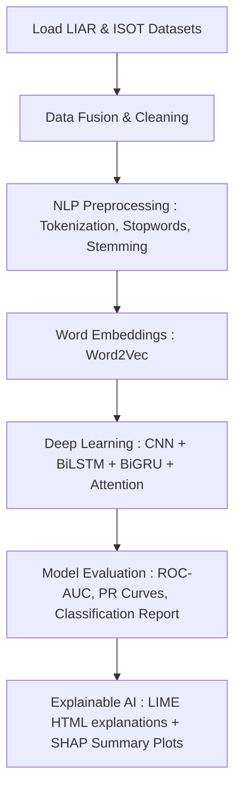

# Textual Fake News Detection

This project presents a robust, end-to-end deep learning pipeline for detecting fabricated and misleading news articles using a unified dataset crafted from the **LIAR** and **ISOT** benchmarks. It leverages advanced Natural Language Processing (NLP), deep sequence modeling, and state-of-the-art model interpretability frameworks:

- **Hybrid Deep Learning Architecture** combining Convolutional Neural Networks (CNNs) for local feature extraction, Bidirectional LSTMs/GRUs for sequential context, and Multi-Head Attention mechanisms for long-range dependency tracking.
- **Robust NLP Preprocessing** pipelines to handle diverse text inputs, including contraction expansion, noise reduction, stopword removal, stemming, and lemmatization.
- **Custom Semantic Embeddings** trained from scratch using Gensim's `Word2Vec` to capture domain-specific semantic relationships within the political and news corpus.
- **Explainable AI (XAI) Integration** via **LIME** (Local Interpretable Model-agnostic Explanations) and **SHAP** (SHapley Additive exPlanations) to crack open the "black box" and visualize exactly which words and embedding dimensions drive the model's classifications.

---

## Pipeline Overview

---

## Notebook Structure & Code Architecture
The entire pipeline is self-contained within the `Textual_Fake_News_Detection.ipynb` notebook, moving sequentially from raw data ingestion to model interpretation.

1. Ingestion & Data Fusion
  - **Dual-Dataset Loading:** Merges the multi-class LIAR and binary ISOT datasets.
  - **Alignment & Splitting:** Binarizes all targets, shuffles the data, and applies stratified boundaries for Training (70%), Validation (15%), and Testing (15%) splits to maintain class ratios.

2. Preprocessing & Text Cleansing Engine
  - **Noise Reduction:** Converts text to lowercase, expands contractions, and uses regular expressions to scrub URLs, digits, and punctuation.
  - **Linguistic Formatting:** Employs NLTK to tokenize text, drop stop words, and apply stemming/lemmatization to reduce words to their base roots.

3. Semantic Feature Engineering (Word Embeddings)
  - **Custom Word2Vec Model:** Trains a 100-dimensional Word2Vec model from scratch specifically on the filtered political and news corpus to capture highly contextual relationships.
  - **Sentence Vectorization:** Transforms the variable-length tokenized sentences into fixed-size continuous vector representations by computing the mean of the constituent word embeddings.

4. Hybrid Deep Learning Architecture
  - **Local Feature Extraction:** Uses 1D Convolutional layers (`Conv1D`) and Max Pooling to capture local n-gram patterns and textual motifs.
  - **Self-Attention Mechanism:** Deploys `MultiHeadAttention` combined with `LayerNormalization` to weigh the importance of different structural features dynamically.
  - **Sequential Context:** Chains Bidirectional LSTMs and GRUs to capture long-range semantic dependencies and temporal context from both directions of the text sequence.
  - **Regularization & Classification:** Utilizes Dropout, Batch Normalization, and L2 regularization to prevent overfitting, funneling into a final Dense layer with a sigmoid activation for binary probability output.

5. Training & Evaluation
  - **Dynamic Learning Optimization:** Implements `ReduceLROnPlateau` to scale down the learning rate during plateaus, alongside `EarlyStopping` to halt training and restore the best model weights to prevent overfitting.
  - **Performance Metrics:** Evaluates the test set generating a robust Classification Report, Precision-Recall Curves, and ROC-AUC visualizations.

6. Explainable AI (XAI) Integration
  - **LIME (Local Interpretable Model-agnostic Explanations):** Extracts text-level feature importance, pinpointing exactly which specific words pushed a given article toward a "Fake" or "True" prediction, saving it as an interactive HTML report.
  - **SHAP (SHapley Additive exPlanations):** Employs KernelExplainer and SHAP text maskers to interpret model predictions, mapping out the specific impact and correlation of underlying embedding dimensions.

---

## Results and Visualization
The notebook generates a rich suite of visual diagnostics natively in the cell outputs to track performance and audit model logic:

  - **Classification Diagnostics:** Visualizes standard evaluation metrics (Accuracy, Precision, Recall, and F1-Score) via bar charts, paired with a plotted Confusion Matrix to monitor true vs. false positives.
  - **ROC & Precision-Recall Curves:** Evaluates the model's threshold dynamics and area under the curve (AUC/AP), proving the model's capability to maintain high confidence and a low false-positive rate across varying thresholds.

### Breaking the Black Box (Interpretability)
To ensure the deep learning model is making decisions based on contextual logic rather than arbitrary noise, the pipeline renders local and global explainability plots:

  - **Interactive LIME Reports:** Generates `lime_explanation.html`, which color-codes and highlights the exact words driving the binary classification of a specific news snippet.
  - **SHAP Summary & Bar Plots:** Maps the SHAP values against the dataset, displaying how individual feature vectors and background summary dimensions contribute to the model's final output probabilities.

*Note: The model correctly maintains 0% fault probability during the first 160 samples (normal operation) before immediately spiking when the anomaly is injected.*
